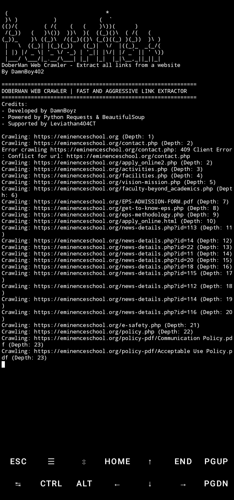

# DoberMan - Advanced Web Crawler/Scraper 🔗

```python
 (                              *                   
 )\ )           )             (  `                  
(()/(        ( /(    (   (    )\))(      )          
 /(_))   (   )\())  ))\  )(  ((_)()\  ( /(   (      
(_))_    )\ ((_)\  /((_)(()\ (_()((_) )(_))  )\ )   
 |   \  ((_)| |(_)(_))   ((_)|  \/  |((_)_  _(_/(   
 | |) |/ _ \| '_ \/ -_) | '_|| |\/| |/ _` || ' \))  
 |___/ \___/|_.__/\___| |_|  |_|  |_|\__,_||_||_|   
```

**DoberMan Web Crawler** - Fast and aggressive link extraction tool for web reconnaissance

[](https://opensource.org/licenses/MIT)

[](https://github.com/psf/black)

---

## 🌟 Features
- Advanced website crawling with depth control
- Internal/external link classification
- Multi-threaded crawling (up to 5 threads)
- Multiple output formats (TXT/JSON)
- URL validation and normalization
- Rich user agent spoofing
- Error handling with graceful exit
- Crawling progress tracking

## 🔍 Tool Review


## ⚙️ Installation
1. Clone repository:
   ```bash
   git clone https://github.com/DamnBoy402/DoberMan.git && cd DoberMan
   ```
2. Install dependencies:
   ```bash
   pip install -r requirements.txt
   ```
   *Requirements:*  
   `requests beautifulsoup4 argparse`

## 🚀 Usage
```bash
python dob.py [URL] [OPTIONS]

Options:
  -d, --depth    Crawling depth (default: 3)
  -f, --format   Output format (txt/json)
  -t, --threads  Number of threads (default: 5)
```

## 📋 Example
```bash
python dob.py https://example.com -d 5 -t 8 -f json
```

## 📂 Output Structure
```
results.[txt|json]
├── Internal Links
├── External Links
└── Visited URLs
```

## 🛡️ Technical Specs
- User Agent: `DoberMan/1.0`
- Timeout: 10 seconds
- Supported Protocols: HTTP/HTTPS
- Platform Independent (Windows/Linux/macOS)

---

### 👥 Credits
- **Developer**: DamnBoy402
- # ★ Special Thanks To: ★
 - Noxs404
 - ChiroXploit404
 - FkzSec
 - Darkness
 - Leviathan404CyberTeam
 - Always Mikaelz
 - Fem|301
 - YhujinOS
 - Laten Cyber
 - Zull
 - HyperXclic!
 - NoTolerance - Ilham
 - C10F - Darkness
 ## And all contributors
 ### You are free to recode this tool, but don't forget to include the original developer!

  
## 📜 License
This project is licensed under the [MIT License](LICENSE).

---

## 🐞 Bug?
If the tool fails, follow these steps:

1. Take a screenshot and see the error
   in detail

2. Contact me through the following
   telegram => [DamnBoy](t.me/DamnBoy404)

3. Submit the screenshot and explain
   your problem with that error
   
## 🤝 Contributing
1. Fork the repository
2. Create feature branch (`git checkout -b feature/amazing-feature`)
3. Commit changes (`git commit -m 'Add amazing feature'`)
4. Push to branch (`git push origin feature/amazing-feature`)
5. Open Pull Request

📌 Please read our [Code of Conduct](coc.md) before contributing.

"Fast like Doberman, precise like surgical knife" - DamnBoy402

## "Feel free to contribute and help us to improve DoberMan"
